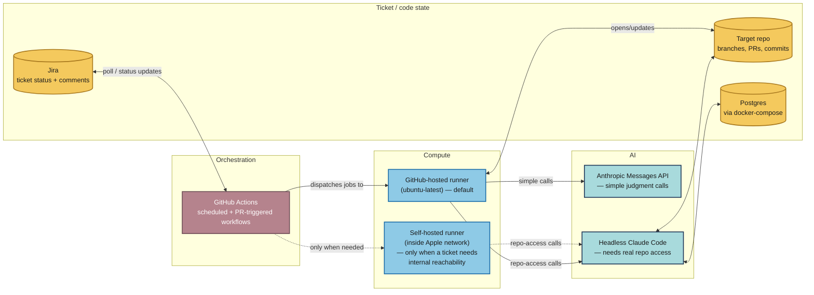
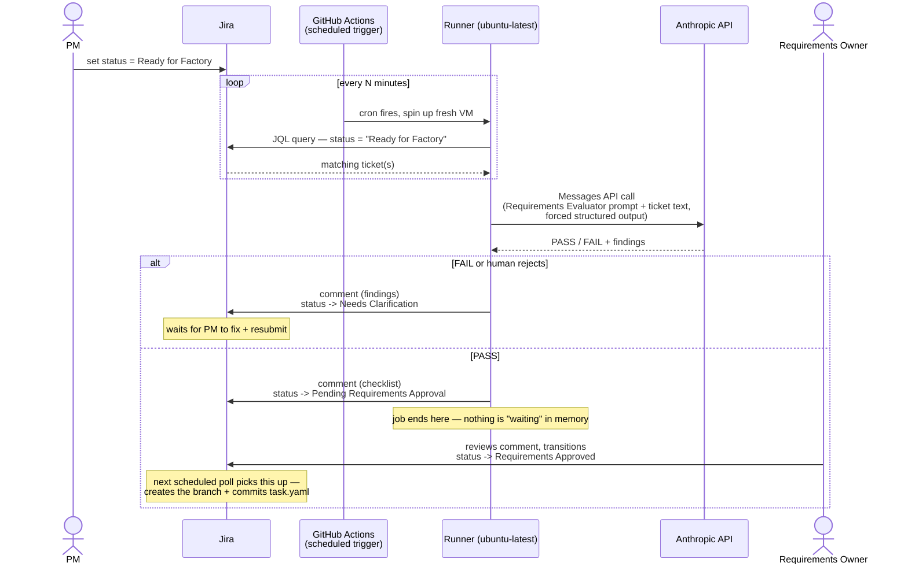
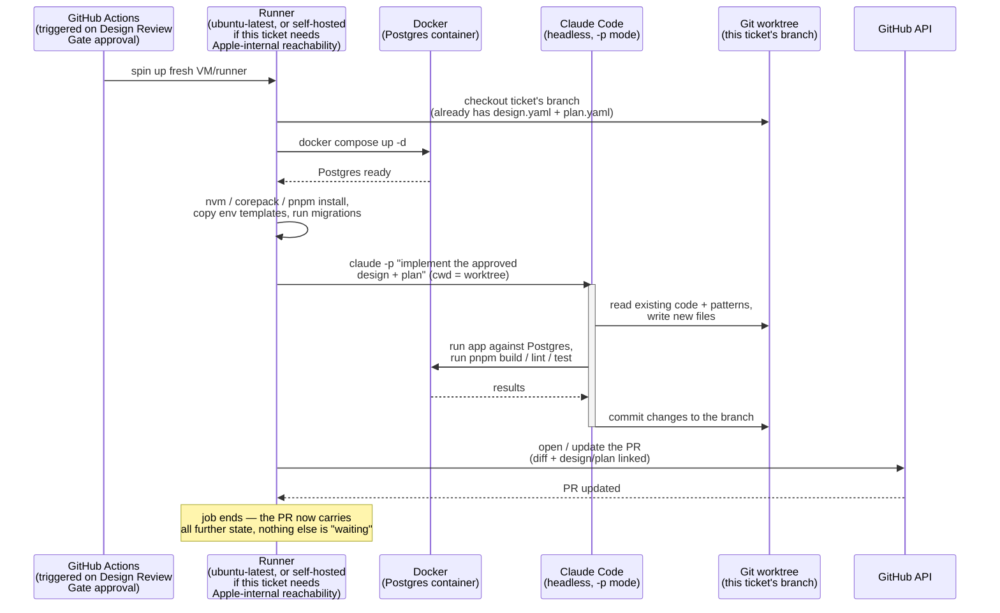

# Claris Commerce — Factory Technical Architecture

Companion to the process/flow diagram — this one answers "what actually runs, where, and who's calling whom," not "what happens and who decides." Two representative patterns cover nearly every AI-driven box in the process diagram; rather than re-diagramming all 18 boxes' infrastructure individually, this traces one worked example of each and states where the rest map to.

## The systems involved

**Nothing here is a long-running server.** Every box in "Compute" is ephemeral — spun up per job, torn down after. The only things that persist between runs are Jira's status field and the git repo/PR itself. That's deliberate: no orchestration server to build or maintain, no in-memory state to lose on a crash.

---

## Pattern 1: simple judgment call — traced through Requirements Gate (boxes 2-5)

No repo access needed, just: read text, return a structured verdict, write the result back to Jira.

Same shape covers **box 16, Release Gate** — a policy check that doesn't need repo access either, just evaluates metadata (approved PR, CI evidence) and decides auto vs. needs-human-approval.

---

## Pattern 2: real repo access — traced through PR Creation / Agent Execution (box 9)

Needs an actual checkout, a database, and a full agentic loop — this is where headless Claude Code (not a single API call) does the work.

Same shape covers **box 6 (Design Plan)**, **box 7 (Implementation Plan)**, and **box 11 (Implementation Verification)** — all need to actually read the codebase, not just judge text. Design Plan and Implementation Plan likely run as one continuous headless Claude Code invocation, since they're sequential AI-only steps with nothing in between that needs a fresh trigger.

---

## Which pattern each process-diagram box uses

| Box | Step | Pattern |
|---|---|---|
| 3 | Requirements Gate | Simple (API call) |
| 6-7 | Design Plan / Implementation Plan | Heavy (headless Claude Code) |
| 9 | PR Creation | Heavy (headless Claude Code) |
| 10 | CI/CD | Neither — plain GitHub Actions build/test, no AI call at all |
| 11 | Implementation Verification | Heavy (needs to inspect the actual diff) |
| 16 | Release Gate | Simple (policy check on metadata) |
| 5, 8, 12, 17 | Human gates | No compute — a human acts directly in Jira or on the PR |

## Two things worth calling out explicitly in the discussion

- **V0 vs. V1**: right now, this entire sequence runs on a developer's own laptop, triggered by hand — none of this is wired to GitHub Actions yet. The diagrams above describe the V1 target, once the factory CLI is built and the team is ready to automate the trigger.
- **Self-hosted runner is conditional, not default**: only the specific job for a ticket that actually needs to reach something inside Apple's network uses it. Everything else — which is most of this pipeline — stays on cheap, standard GitHub-hosted runners.
