# Claris Commerce — Proposed Factory Workflow

Reconciled version: your friend's original 11-step plan plus the two additions discussed with the team — **Design Plan** and **Design Review Gate** — inserted between Requirements Gate and PR Creation.

**Numbering:** every box is numbered, sequentially, in reading order — gates, blocked states, and the shared retry box included, not just the main pipeline phases. Any number you say in a walkthrough refers to exactly one box.

**Key idea:** box 8, Design Review Gate, is the one step where a human signs off on the technical approach *before* any code is written. Everything downstream of it is mechanical execution against an already-approved blueprint — which is why box 12, PR Review Gate, can stay lightweight.

**On Jira status:** shown in each box as `Jira: ...`. Box 2, "Ready for Factory," is a single shared waiting state — both a fresh ticket (from box 1) and a fixed-and-resubmitted one (from box 4, Blocked) land in the exact same status before Requirements Gate picks it up. It doesn't matter to the ticket which path got it there.

```mermaid
flowchart TD
    S1["1. Business Intake<br/>(H) PM creates/refines Jira ticket<br/><b>Jira: Backlog</b>"]
    S1 -->|PM submits| S2

    S2["2. Ready for Factory<br/>queued, waiting for pickup<br/><b>Jira: Ready for Factory</b>"]
    S2 --> S3

    S3["3. Requirements Gate<br/>(A) Requirements Evaluator checks<br/>completeness / ambiguity / testability<br/><b>Jira: In Progress - Requirements</b>"]
    S3 -->|FAIL| S4["4. Blocked<br/>gaps + questions posted to PM<br/><b>Jira: Needs Clarification</b>"]
    S4 -->|PM fixes ticket, resubmits| S2
    S3 -->|PASS| S5{"5. Requirements Owner<br/>approves?<br/><b>Jira: Pending Requirements Approval</b>"}
    S5 -->|approve| S6
    S5 -->|reject| S4

    S6["6. Design Plan<br/>(A) Design Agent explores the codebase,<br/>proposes 2-3 approaches<br/><b>Jira: Requirements Approved -&gt; In Design</b>"]
    S6 --> S7

    S7["7. Implementation Plan<br/>(A) Planner Agent breaks the<br/>chosen approach into files/tests/sequence<br/><b>Jira: In Design</b>"]
    S7 --> S8

    S8{"8. Design Review Gate<br/>(A) self-check vs pattern registry,<br/>then (H) human reviews<br/><b>Jira: Pending Design Review</b>"}
    S8 -->|approve| S9
    S8 -->|human edits directly| S9
    S8 -->|send back w/ feedback| S6

    S9["9. PR Creation<br/>(A) headless Claude Code generates<br/>code + tests, runs local checks,<br/>opens draft PR<br/><b>Jira: In Development</b>"]
    S9 --> S10

    S10["10. CI / CD<br/>build - lint - full test suite<br/>on the PR<br/><b>Jira: In Development</b>"]
    S10 -->|FAIL| S9
    S10 -->|PASS| S11

    S11["11. Implementation Verification<br/>(A) every acceptance criterion<br/>actually implemented + tested?<br/><b>Jira: In Development</b>"]
    S11 -->|FAIL| S9
    S11 -->|PASS| S12

    S12{"12. PR Review Gate<br/>(H) final review - lighter now,<br/>design was already approved<br/><b>Jira: Pending PR Review</b>"}
    S12 -->|changes requested| S9
    S12 -->|approve, merge| S13

    S13["13. PreProd Verification<br/>deploy to preprod,<br/>confirm it actually works<br/><b>Jira: Merged - Deploying</b>"]
    S13 --> S14

    S14["14. Observability Verification<br/>logs / metrics / traces flowing<br/><b>Jira: Merged - Deploying</b>"]
    S14 --> S15

    S15["15. Performance Verification<br/>nightly perf-env run,<br/>no regression vs last merge<br/><b>Jira: Merged - Deploying</b>"]
    S15 --> S16

    S16{"16. Release Gate<br/>(A) policy check - does target<br/>env need human approval?<br/><b>Jira: Merged - Deploying</b>"}
    S16 -->|auto| S18
    S16 -->|needs approval| S17["17. Release Owner approves<br/><b>Jira: Pending Release Approval</b>"]
    S17 --> S18

    S18["18. Release and Learning<br/>(A) merge + deploy + post-deploy check,<br/>(A) extract reusable patterns,<br/>(H) Factory Owner approves promotion<br/><b>Jira: Released -&gt; Done</b>"]

    classDef human fill:#f4c95d,stroke:#a8791f,color:#1a1a1a,stroke-width:2px;
    classDef ai fill:#8ecae6,stroke:#1b6ca8,color:#1a1a1a,stroke-width:2px;
    classDef critical fill:#ff6b6b,stroke:#a13232,color:#fff,stroke-width:3px;
    classDef blocked fill:#e0e0e0,stroke:#888,color:#333,stroke-dasharray: 4 2;

    class S1,S5,S12,S17 human;
    class S3,S6,S7,S9,S10,S11,S13,S14,S15,S18 ai;
    class S8 critical;
    class S2,S4 blocked;
```

## Key

- **Gold** — human-only boxes
- **Blue** — AI/automated boxes
- **Red** — box 8, Design Review Gate, called out deliberately: the one step where being wrong is expensive if skipped
- **Grey (dashed)** — waiting / bounce-back states (box 2, Ready for Factory; box 4, Blocked)

## Jira status reference

| Status | Set by | Covers |
|---|---|---|
| `Backlog` | Ticket creation | Box 1, before submission |
| `Ready for Factory` | PM (manual) | Box 2 — shared entry point, whether arriving fresh from box 1 or resubmitted from box 4 |
| `In Progress - Requirements` | Automation | Box 3, while the evaluator runs |
| `Needs Clarification` | Automation (on FAIL/reject) | Box 4 — bounces back to box 2, not directly to box 3 |
| `Pending Requirements Approval` | Automation | Box 5, waiting on the Requirements Owner |
| `Requirements Approved` | Requirements Owner (manual) | Boundary — branch/worktree + `task.yaml` created here |
| `In Design` | Automation | Boxes 6-7 |
| `Pending Design Review` | Automation | Box 8 |
| `In Development` | Automation | Boxes 9-11 — the PR itself carries finer detail from here |
| `Pending PR Review` | Automation | Box 12 |
| `Merged - Deploying` | Automation (on merge) | Boxes 13-16 |
| `Pending Release Approval` | Automation | Box 17, only if the target env needs sign-off |
| `Released` | Automation (on deploy) | Box 18 |
| `Done` | Automation (on learning-promotion approval) | Ticket fully closed |

**Still open:** no retry limit on the box 2/4 loop (or the box 6/8 loop) — a ticket can bounce indefinitely right now. Worth a cap before this ships.

## What changed vs. the original plan

- Added **Design Plan** (box 6) and **Design Review Gate** (box 8) — front-loads the one real judgment call to the cheapest point in the pipeline instead of the most expensive one
- **PR Creation** (box 9) moved earlier — the PR exists from there onward, so review happens on one continuously-evolving artifact
- **CI/CD** (box 10) now runs before **Implementation Verification** (box 11) — cheap, deterministic checks gate first; expensive AI judgment only runs once the basics are green
- **PR Review Gate** (box 12) is intentionally lighter — the design was already approved, so this is checking execution, not re-litigating the approach
- **Performance Verification** (box 15) added as its own step
- **Ready for Factory** unified into a single shared box (box 2) — both the fresh-ticket path and the fixed-and-resubmitted path land in the same waiting state, rather than being represented two different ways
